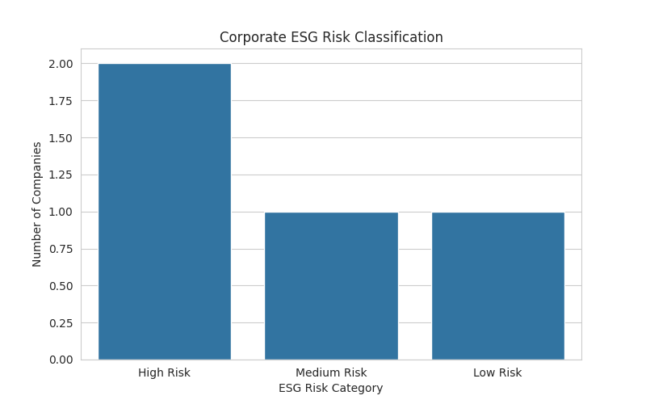

# 📊 ESG Risk Scoring Model for Banking Analytics

This project builds a corporate ESG risk scoring model using sustainability metrics from Fortune 500 companies. The objective is to simulate how banks and financial institutions assess environmental risk exposure when making lending or investment decisions.

## Project Objectives

• Analyse corporate ESG emissions data  
• Build an ESG risk scoring framework  
• Classify companies into Low, Medium, and High ESG Risk categories  
• Simulate ESG-based credit risk screening used in sustainable finance  

## Dataset

Fortune 500 ESG Metrics Dataset (2021–2023)

The dataset contains corporate environmental indicators including:

- Scope 1 greenhouse gas emissions
- Scope 2 greenhouse gas emissions
- Emission intensity metrics
- Environmental sustainability disclosures

Total observations analysed: **550,000+ records**

## Methodology

1. Data cleaning and preprocessing using Pandas  
2. Extraction of environmental emission metrics  
3. Aggregation of company-level ESG indicators  
4. ESG risk classification based on emission intensity thresholds  
5. Machine learning classification using Random Forest  

## Tools Used

- Python
- Pandas
- NumPy
- Scikit-learn
- Seaborn
- Google Colab

## Output
## Output

The model classifies companies into three ESG risk categories:

- Low ESG Risk
- Medium ESG Risk
- High ESG Risk

### ESG Risk Distribution

The distribution highlights variation in corporate environmental exposure, providing a simplified framework for ESG-based lending risk screening.

## Key Insights

• Companies with higher greenhouse gas emissions tend to fall into the High ESG Risk category.  
• The ESG risk scoring model provides a simplified framework for identifying environmentally exposed firms.  
• ESG risk classification can support responsible lending decisions in sustainable finance frameworks.  

## Real-World Applications

This analysis demonstrates how ESG and sustainability data can support:

• Responsible lending and credit risk screening  
• ESG portfolio construction  
• Sustainable investment strategy evaluation  
• Climate-related financial risk analysis.

## Repository Structure

project-name
│
├── analysis_notebook.ipynb
├── results_dataset.csv
├── visualisations
│   ├── risk_distribution.png
│   ├── risk_return_plot.png
│
└── dataset_source.txt
